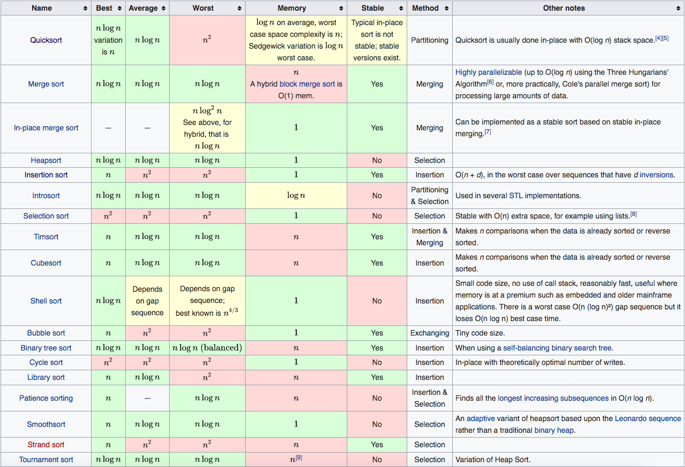
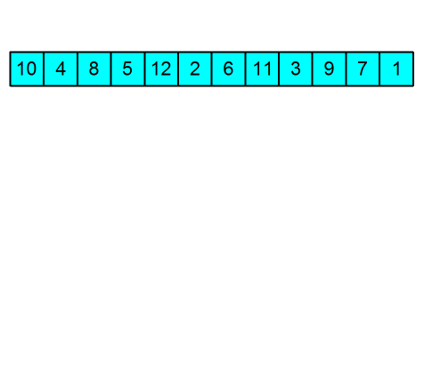

# Sorting algorithms
a sorting algorithm is an algorithm that puts elements of a list into an order. The most frequently used orders are numerical order and lexicographical order, and either ascending or descending. Efficient sorting is important for optimizing the efficiency of other algorithms that require input data to be in sorted lists (like binary search).

## Classification criteria:

- **Computational complexity**: 
Best, worst and average case behavior in terms of the size of the list. For typical serial sorting algorithms, good behavior is **O(n log n)**, and bad behavior is O(n^2). Ideal behavior for a serial sort is O(n), but this is not possible in the average case.
- **Memory usage**: 
Some sorting algorithms are "in-place". Strictly, an in-place sort needs only **O(1)** memory beyond the items being sorted, sometimes O(log n) additional memory is considered "in-place".
- **Stability**: 
**stable** sorting algorithms maintain the relative order of records with equal keys (i.e., values). Whether or not they are a comparison sort. A comparison sort examines the data only by comparing two elements with a comparison operator.

# Stable vs Unstable
Stable sort algorithms sort equal elements in the same order that they appear in the input, so a sorting algorithm is said to be stable if two objects with equal keys appear in the same order in sorted output as they appear in the input data set. For Example Merge Sort is a stable sorting algorithm, while Quick Sort is an unstable one. The default sorting is stable in Python, unstable in Ruby.

## why we care ?
Stability is mainly essential when we have key-value pairs with duplicate keys possible. And we want to sort these objects by keys. For example, a rows in a spreadsheet containing student data, that is by default sorted by name. We would like to sort it by grades while maintaining the sorted order of the names. While With an unstable sort, it could be shuffles the name order, resulting in a nonalphabetical list of students.

On the other hand When equal elements are indistinguishable, such as with integers, or more generally, any data where the entire element is the key, stability is not an issue. Stability is also not an issue if all keys are different.

## Can we make sorting algorithm stable? 
Any given sorting algorithm which is not stable can be modified to be stable. Any comparison-based sorting algorithm which is not stable by nature can be modified to be stable by changing the key comparison operation so that the comparison of two keys considers position as a factor for objects with equal keys.

# Comparison of Sorting Algorithms


# Examples of Sorting Algorithms

## Insertion sort
Insertion sort is one of the most basic sorting algorithms that essentially inserts 
an element into the right position of an already sorted list. It is usually added at the end 
of a new array and moves down until it finds an element smaller thank itself (the desired position). 
The process repeats for all the elements in the unsorted array.


```
T: O(N **2) [AVG, WORST] 
   O(N) [BEST] 
S: O(1) 
```
<details>
<summary> View Code </summary>

```python
def insertion_sort(array: list) -> list:
    for index, number in enumerate(array):
        for index_2, number_2 in enumerate(array[:index]):
            if number < number_2:
                array[index], array[index_2] = array[index_2], array[index]

    return array
```
</details>

## Selection sort
Selection sort is a simple and efficient sorting algorithm that works by repeatedly selecting the smallest 
(or largest) element from the unsorted portion of the list and moving it to the sorted portion of the list. 
This process is repeated for the remaining unsorted portion until the entire list is sorted. 


```
T: O(N **2) [AVG, BEST, WORST]
S: O(1)
```
<details>
<summary> View Code </summary>

```python
def selection_sort(array: list) -> list:
    for index in range(len(array)):
        minimum_index = index
        for index_, number in enumerate(array[index:], start=index):
            if number < array[minimum_index]:
                minimum_index = index_

        array[minimum_index], array[index] = array[index], array[minimum_index]

    return array
```
</details>


## Bubble Sort
Bubble Sort is the simplest sorting algorithm that works by repeatedly swapping the adjacent elements 
if they are in the wrong order. This algorithm is not suitable for large data sets as its average and 
worst-case time complexity is quite high.


```
T: O(N **2) [AVG, WORST]
   O(N) [BEST]
S: O(1)
```
<details>
<summary> View Code </summary>

```python
def bubble_sort(array: list) -> list:
    for _ in array:
        for index, _ in enumerate(array[:-1]):
            if array[index] > array[index + 1]:
                array[index], array[index + 1] = array[index + 1], array[index]

    return array
```
</details>


## Merge sort
Merge sort is a sorting algorithm that works by dividing an array into smaller subarrays, 
sorting each subarray, and then merging the sorted subarrays back together to form the final sorted array.


```
T: O(N log N) [AVG, BEST, WORST]
S: O(N)
```

<details>
<summary> View Code </summary>

```python
def merge(array_1: deque, array_2: deque) -> list:
    result = []
    while array_1 and array_2:
        if array_1[0] < array_2[0]:
            result.append(array_1.popleft())
        else:
            result.append(array_2.popleft())

    # Append any remaining elements
    result.extend(array_1)
    result.extend(array_2)

    return result


def merge_sort(array: list) -> list:
    if len(array) <= 1:
        return array

    middle = len(array) // 2
    left = merge_sort(array[:middle])
    right = merge_sort(array[middle:])

    return merge(deque(left), deque(right))
```
</details>


## Heap Sort
Heap sort is a comparison-based sorting technique based on Binary Heap data structure. It constructs a max heap, repeatedly extracts the largest element (root) and places it at the end, then rebalances the heap. This process continues until the entire array is sorted, and no elements left in the heap. Full implementation with O(1) space [found here](https://cosmictechie.hashnode.dev/heap-sort)



```
T: O(N log N) [AVG, BEST, WORST]
S: O(1)
```
<details>
<summary> View Code </summary>
for simplicity I'm doing it with O(N) space

```python
def heap_sort(array: list) -> list:
    heap = PriorityQueue()
    for number in array:
        heap.put(number)

    return [heap.get() 
            for _ in range(len(array))]
```
</details>

## Quick Sort
QuickSort is a sorting algorithm based on the Divide and Conquer algorithm that picks an element 
as a pivot and partitions the given array around the picked pivot by placing the pivot in its correct 
position in the sorted array.


```
T: O(N log N) (AVG, BEST)
   O(N^2) (WORST)
S: O(log N) [AVG, BEST]
   O(N) (WORST)
```
<details>
<summary> View Code </summary>

```python
def quick_sort(array: list) -> list:
    if len(array) < 2:
        return array

    pivot_index = len(array) // 2

    left, right = partition(array, array[pivot_index])
    array = quick_sort(left) + [array[pivot_index]] + quick_sort(right)

    return array


def partition(array: list[int], pivot: int) -> tuple[list[int]]:
    left = []
    right = []

    for number in array:
        if number < pivot:
            left.append(number)
        elif number > pivot:
            right.append(number)
    return left, right
```
</details>


## Tim Sort
Tim Sort is a hybrid sorting algorithm derived from **merge sort** and **insertion sort**. It was designed to perform well on many kinds of real-world data. It's the default sorting algorithm used by **Python**, **Android**, and **Java**

```
T: O(N log N) [AVG, WORST]
   O(N) [BEST]
S: O(N)
```

<details>
<summary> View Code </summary>

```python
from insertion_sort import insertion_sort


def merge(array_1, array_2):
    result = []
    while array_1 or array_2:
        if array_1 and not array_2:
            result += array_1
            return result
        if array_2 and not array_1:
            result += array_2
            return result

        if array_1[0] < array_2[0]:
            result.append(array_1.pop(0))
        else:
            result.append(array_2.pop(0))

    return result


def tim_sort(array: list, run_size: int = 4) -> list:
    def separate(array):
        if len(array) > run_size:
            mid = len(array) // 2
            array_2 = array[mid:]
            array_1 = array[:mid]

            array_1 = separate(array_1)
            array_2 = separate(array_2)

            array = merge(array_1, array_2)
            return array

        return insertion_sort(array)

    return separate(array)
```
</details>
